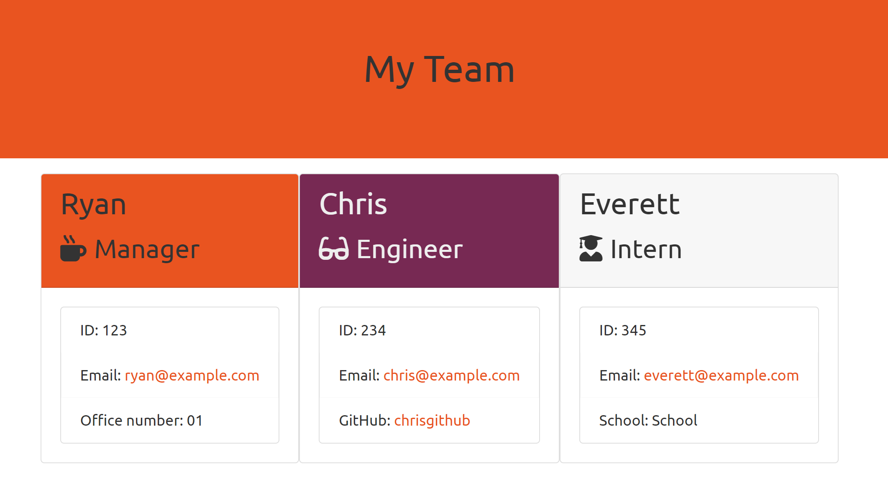
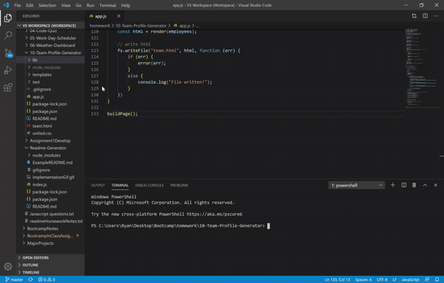

# Team Profile Generator


    
## Description
This application takes user input for information on any number of team members, and generates a team profile as an html page.
    
### User Story
```
AS a manager
I WANT A team profile website generator
SO THAT I can easily compile teams' information in a web page
```
    
## Installation
This application runs as a Node CLI
Run the following commands to use this application
```
npm install inquirer
node app.js
``` 
## Usage 
Follow the prompts in the terminal.
The user may enter information for any number of employees in any order.
    
## Tests
This application was testing during development using jest.js
    
## Example Result


## Implementation

